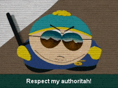

# Arthur Pluym

## Who am I?
For those who don't know me, I am the legendary conquerer of the knights who say "Ni"!

I don't think more info is needed, is it?

Allright then,

Somewhere in the future I'll be famous for becomming the first person ever to become world champion Darts
while holding the title of "King of the round table".

Because this title is not a very humble one -and rightfully so-,
I mostly go by one of my aliases: 'Lancelot's King', 'Guinevere's Husband', 'Excalibur's wielder', 'Merlin's favourite' or 'Camelot's owner'.

As a king, I have the right to make rules and laws. My favourite so far is this one: 'No rain allowed on hunting days.'.

For it was a very hard one to get done, I am quite happy that volleybal and darts are practiced inside and don't require such a rule.

## What I can do that might surprise you
As a king, everything is known about me, I do not have many more secrets -a negative perk that comes with it- but maybe this one will suprise you...

I speak some Japanese -Not bad for an English King, is it?-,

 it still is at basic level at best, but please cut me some slack.

## Things my Universe absolutely has to have
* Food
* Drinks
* Good weather

## I am gonna accomplish this
As a develloper I wanna aquire the skills needed to be a worldwide seeked for -a king doesn't settle for less- webdevelloper

in order for me to accomplish my long time dream of living somewhere abroad -can you guess why I'm learning Japanese?-

while doing a job that I like -until I become world champion of course-.

My second accomplishment I like to secure in this seven months is a quite large upgrade of my proficiency in French.

And last, I would like to get to know some people in the industry -future, junior, senior,...-
who can maybe help me when I need it -of course, they can rely on me as well. You have my word, the word of a king-.

## This scares the crap out of me
* The Knights who say 'Ni' -I overcame this fear and defeated them, though-
* Going mad. Notthing drives me more mad than the idea of getting mad. -Hope I die before that happens-

## This is why I am alive
This question is an easy one, no thinking involved.

I look forward to the moment I have seen the whole world -and of course to every stage as well-

and the moment I lift the trophy of the PDC World Darts Championship!

> “Belief creates the actual fact.”
> — William James

## Teamwork dreamwork
1. Shared trouble, shared responsibilities, shared pain
2. Twice, thrice, whateverice as fast -in perfect conditions-
3. I function better with people around me

## Just a random gif

### References
- [King Arthur](https://www.youtube.com/watch?v=AmtSj4wH5Rg)
- [Cartman](https://www.southparkstudios.com/)

### Accounts
- [Chess](https://www.chess.com/member/guinevereshusband)
- [Twitch](https://www.twitch.tv/guinevereshusband)

